<!-- HEADER -->

  

<!-- TYPING SVG -->

  

 

<!-- YILMAZ.GAMES HIGHLIGHT -->

  

 

<!-- ABOUT ME -->

> Software engineer turned entrepreneur, and founder of [**yilmaz.games**](https://yilmaz.games).
> I combine technical expertise with a passion for creating authentic, competitive game experiences — bringing classic games into the digital era for a global audience.

---

<!-- SOCIALS -->

  
  &nbsp;
  
  &nbsp;
  

---

<!-- GITHUB STATS -->

  
  &nbsp;&nbsp;
  

 

  

---

<!-- TROPHIES -->

  

---

<!-- ACTIVITY GRAPH -->

  

---

<!-- CONTRIBUTION INSIGHTS (generated by GitHub Action) -->

  

 

  

---

<!-- FOOTER -->

  

  

